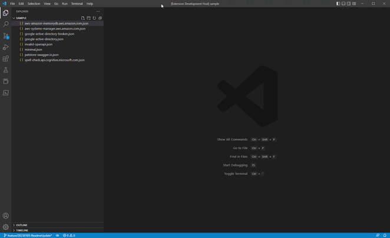
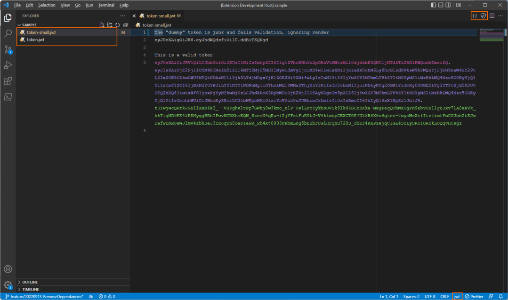
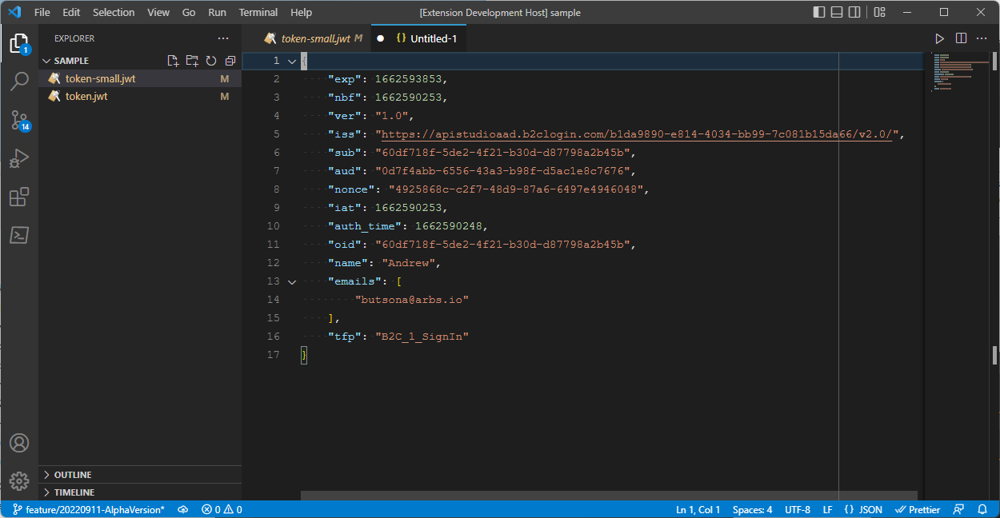

# vscode-openapi-viewer

This vscode extension detects jwt and provides a quick access decoder. The vscode-openapi-viewer extension has been created to avoid copying live tokens to random websites. This extension works locally, and **DATA NEVER LEAVES YOUR MACHINE**

## What is a JWT?

JSON Web Tokens (JWT) are an open, industry-standard RFC 7519 method for representing claims securely between two parties. A JWT is a structured security token format used to encode JSON data. The main reason to use JWT is to exchange JSON data in a way that can be cryptographically verified.

There are two types of JWTs:

- JSON Web Signature (JWS)
- JSON Web Encryption (JWE)

The data in a JWS is public—meaning anyone with the token can read the data. Whereas a JWE is encrypted and private. Therefore, to read data contained within a JWE, you need both the token and a secret key. When you use a JWT, it's usually a JWS. The 'S' (the signature) is essential and allows the token to be validated. This extension is designed to work with JWS out of the box, but support for JWE will be added if there is interest.

## Getting started

Copy a token into a document and set the language to jwt. Eventually, vscode will detect the content as a jwt and switch to jwt language extension automatically.

The tokens are highlighted in an easy-to-identify scheme

Once decoded the JSON is created on a separate panel

## Build Info

- vsce package --out "releases"

## **How can I help?**

If you enjoy using the extension, please give it a rating on the [Visual Studio Marketplace](https://marketplace.visualstudio.com/items?itemName=AndrewButson.vscode-openapi-viewer).

Should you encounter bugs or if you have feature requests, head on over to the [GitHub repo](https://github.com/arbs-io/vscode-openapi-viewer) to open an issue if one doesn't already exist.
Pull requests are also very welcome since I can't always get around to fixing all bugs myself.

This is a personal passion project, so my time is limited.

Another way to help out is to [sponsor me on GitHub](https://github.com/sponsors/arbs-io).

## **Copyright**

Copyright 2021 - 2022 Api Studio, Inc.

Licensed under the MIT License
