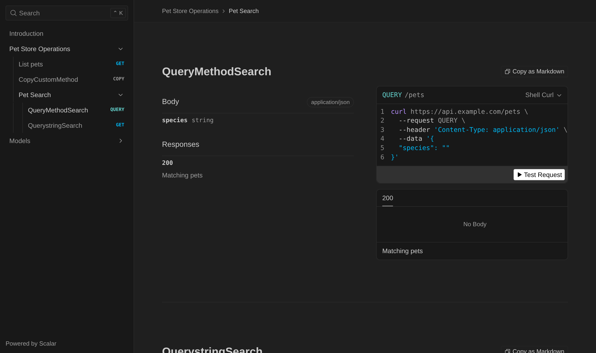

# OpenAPI Viewer for VS Code

[](https://marketplace.visualstudio.com/items?itemName=AndrewButson.vscode-openapi-viewer)
[](https://marketplace.visualstudio.com/items?itemName=AndrewButson.vscode-openapi-viewer)
[](https://marketplace.visualstudio.com/items?itemName=AndrewButson.vscode-openapi-viewer&ssr=false#review-details)
[](https://github.com/arbs-io/vscode-openapi-viewer/actions/workflows/vsix-package.yaml)
[](LICENSE)

[](https://sonarcloud.io/summary/new_code?id=arbs-io_vscode-openapi-viewer)
[](https://sonarcloud.io/summary/new_code?id=arbs-io_vscode-openapi-viewer)
[](https://sonarcloud.io/summary/new_code?id=arbs-io_vscode-openapi-viewer)
[](https://sonarcloud.io/summary/new_code?id=arbs-io_vscode-openapi-viewer)

Preview OpenAPI and Swagger documents right next to the file you're editing. Open a spec, click the preview button, and you get interactive API documentation that updates as you type. You can browse operations, inspect schemas and send test requests without leaving VS Code.

OpenAPI 3.2, 3.1, 3.0 and Swagger 2.0 are supported, in JSON or YAML.



## Features

- **Live preview.** The preview refreshes shortly after you stop typing. If the file is briefly invalid mid-edit, the last good version stays on screen until it parses again.
- **OpenAPI 3.2.** Tag display names and nested tags, the `QUERY` method, custom methods through `additionalOperations`, `querystring` parameters, streaming responses (`itemSchema`), `dataValue` examples and the OAuth 2.0 device authorization flow all render properly.
- **Try requests.** Pick a server, set up authentication and send a request from the preview, with generated client code for curl and common languages.
- **Follows your theme.** Colours and fonts come from the active VS Code theme, including light, dark and high contrast.
- **Private by default.** With the default renderer the preview loads nothing from the internet. Telemetry, hosted fonts, request proxies and AI features are all switched off.
- **Two renderers.** [Scalar](https://github.com/scalar/scalar) is the default. [RapiDoc](https://github.com/rapi-doc/RapiDoc), the renderer used before version 2.0, is still available if you prefer it.

## Getting started

1. Install **vscode-openapi-viewer** from the [Visual Studio Marketplace](https://marketplace.visualstudio.com/items?itemName=AndrewButson.vscode-openapi-viewer), or run:

   ```sh
   code --install-extension AndrewButson.vscode-openapi-viewer
   ```

2. Open an OpenAPI or Swagger file (`.json`, `.yaml` or `.yml`).
3. Click the OpenAPI icon in the editor title bar, or run **openapi: Show API Specification** from the Command Palette (`Ctrl+Shift+P` / `Cmd+Shift+P`).

The preview opens beside your editor. The icon only appears when the file has a top-level `openapi` or `swagger` field.

## Supported specifications

| Specification | Scalar (default) | RapiDoc |
| --- | --- | --- |
| OpenAPI 3.2 | Yes | Partly. Features new in 3.2 are not shown |
| OpenAPI 3.1 | Yes | Yes |
| OpenAPI 3.0 | Yes | Yes |
| Swagger 2.0 | Yes | Yes |

If you want to see what 3.2 looks like in the preview, open [samples/json/openapi-3.2-features.json](samples/json/openapi-3.2-features.json).

## Settings

| Setting | Default | What it does |
| --- | --- | --- |
| `openapi.preview.renderer` | `scalar` | Choose `scalar` or `rapidoc`. OpenAPI 3.2 features need `scalar`. |
| `openapi.preview.markdownLineBreaks` | `false` | Show single line breaks in `description` text as line breaks. By default descriptions follow CommonMark, as the OpenAPI Specification requires, where a single newline is shown as a space. Turn this on if your descriptions are written with GitHub-style line breaks. |

## Sending test requests

Requests are sent straight from the preview to your API. Nothing goes through a proxy, so the API sees the request exactly as you built it. The preview runs inside a VS Code webview, so the usual browser rules apply. Your API has to allow cross-origin requests (CORS) for the response to be readable. If a request fails with a network error, check the API's CORS configuration first.

## Known limitations

- References to other files (for example `$ref: ./schemas/pet.yaml`) are not followed yet. References inside the same document work.
- There is one preview panel at a time. Opening the preview from another file switches the panel to that file.
- The preview button is hidden for read-only editors such as diff views.

## Building from source

You'll need Node.js 22.13 or later and Yarn (the repo pins its own version through `.yarn/releases`).

```sh
yarn install
yarn lint
yarn typecheck
yarn package     # builds the .vsix
```

Press `F5` in VS Code to start an Extension Development Host with the extension loaded. The `samples` folder has specs to test against, including a few broken ones.

The renderers are vendored in `assets/`. To move to a newer Scalar release, run `node scripts/vendor-scalar.mjs <version>`. The script checks the package integrity against the npm registry before writing the bundle.

## Contributing

Bug reports and feature requests are welcome in [GitHub issues](https://github.com/arbs-io/vscode-openapi-viewer/issues). A small spec that reproduces the problem makes a bug far easier to track down. Pull requests are very welcome too. This is a personal project and my time is limited, so I can't always get to every bug myself.

If the extension is useful to you, a rating on the [Marketplace](https://marketplace.visualstudio.com/items?itemName=AndrewButson.vscode-openapi-viewer&ssr=false#review-details) helps other people find it. You can also [sponsor the project on GitHub](https://github.com/sponsors/arbs-io).

## Credits

The preview is rendered by [Scalar API Reference](https://github.com/scalar/scalar) and [RapiDoc](https://github.com/rapi-doc/RapiDoc). Both are MIT licensed, and their licences ship with the extension in `assets/`.

## License

[MIT](LICENSE)
